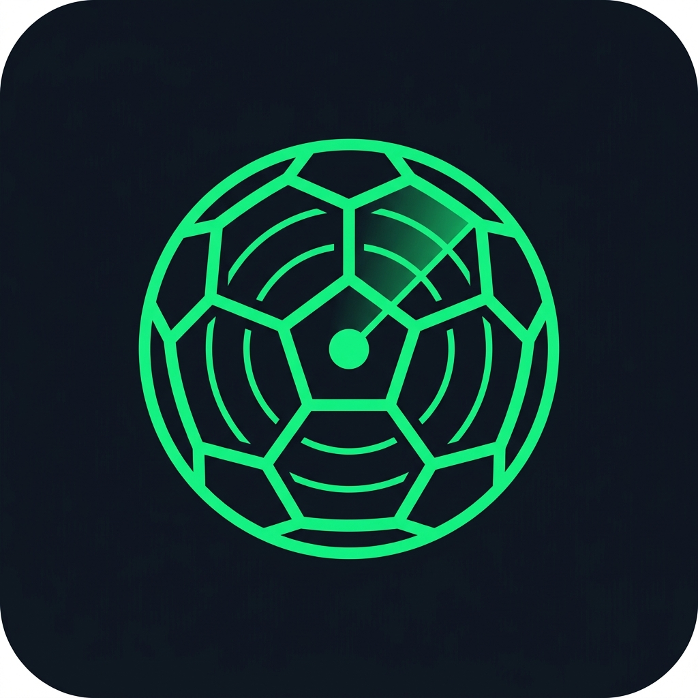

# ⚽ Sportify — AI-Powered Football Talent Discovery

<p align="center">
  
</p>

<p align="center">
  <strong>A premium mobile-first prototype of the Sportify scouting platform.</strong><br>
  Built in 24 hours to demonstrate production-grade Flutter architecture, state management, and UI/UX execution.
</p>

<p align="center">
  <a href="https://mustafaammard.github.io/sportify/">🔗 Live Demo</a> •
  <a href="#-architecture">Architecture</a> •
  <a href="#-state-management">State Management</a> •
  <a href="#-performance-optimisations">Performance</a>
</p>

---

## 📱 Screens

| Screen | Description |
|---|---|
| **Splash** | Animated brand intro with Sportify logo, fade+scale animation, and progress indicator |
| **Discover** | Hero player carousel, Highlight Reels with dark overlays, debounced search bar, and a responsive player grid |
| **Player Profile** | Full scouting report — AI Fit Score gauge, career timeline, stats grid, highlight video placeholder, and "Why This Player" AI reasoning |
| **AI Scouting** | Filter by position, age range, preferred foot, and max budget → AI-ranked results sorted by fit score |

---

## 🏗️ Architecture

The project follows **Feature-First Clean Architecture**, separating concerns into independent, testable layers:

```
lib/
├── core/                     # Design system & constants
│   ├── theme/                # AppColors, AppTextStyles, AppTheme
│   └── constants/            # Positions, foot options, etc.
├── data/                     # Data layer (fully swappable)
│   ├── models/               # Player, CareerEntry, PlayerStats, ScoutingFilter, AiFitReason
│   ├── mock/                 # MockPlayers — static JSON-equivalent data
│   └── repositories/         # PlayerRepository (abstract) + MockPlayerRepository
├── providers/                # Riverpod providers — single source of truth
├── screens/                  # Feature-first screen modules
│   ├── splash/               # Animated splash screen
│   ├── discover/             # Home screen with search + carousel
│   │   └── widgets/          # SearchBarSliver, HighlightReelsSliver, PlayerGridSliver
│   ├── player_profile/       # Full player scouting report
│   │   └── widgets/          # ProfileHeroHeader, PlayerInfoGrid, CareerStatsSection
│   └── scouting/             # AI-powered filter & ranked results
│       └── widgets/          # ScoutingFiltersCard, AnimatedResultCard
└── widgets/                  # 10 shared, reusable components
    ├── app_image.dart         # Cross-platform image handler (asset + network + error fallback)
    ├── player_card.dart       # Discover grid card
    ├── featured_player_card.dart  # Hero carousel card
    ├── highlight_card.dart    # Video thumbnail with dark overlay + play button
    ├── ai_score_indicator.dart    # Animated circular AI score gauge
    ├── career_timeline.dart   # Vertical timeline with mini-stats per club
    ├── availability_badge.dart    # Color-coded transfer status chip
    ├── stat_badge.dart        # Labelled stat display
    ├── why_this_player.dart   # AI reasoning breakdown card
    └── sportify_logo.dart     # Branded logo with neon-green accent
```

### Key Architectural Decisions

- **Repository Pattern**: `PlayerRepository` is an abstract interface. The entire data layer can be swapped from `MockPlayerRepository` to a `LaravelPlayerRepository` without touching a single UI file.
- **Feature-First Structure**: Each screen's widgets, state, and logic are co-located, making the codebase easy to navigate, scale, and onboard new developers.
- **GoRouter**: Declarative routing with deep-linking support. Player profiles use parameterised routes (`/player/:id`).
- **10 Reusable Widgets**: All shared components are decoupled from screens, accepting data via constructor parameters for maximum reusability and testability.

---

## 🔄 State Management

**Riverpod 3.x** (`flutter_riverpod: ^3.3.2`) with the modern `Notifier` / `FutureProvider` pattern — no legacy `StateNotifier` or `StateProvider`.

### Provider Architecture

| Provider | Type | Purpose |
|---|---|---|
| `playerRepositoryProvider` | `Provider` | Dependency injection — swappable data source |
| `allPlayersProvider` | `FutureProvider` | All players for the Discover grid |
| `featuredPlayersProvider` | `FutureProvider` | Featured players for the hero carousel |
| `searchQueryProvider` | `NotifierProvider` | Live text field value (instant UI updates) |
| `debouncedSearchQueryProvider` | `NotifierProvider` | Debounced query (fires 400ms after typing stops) |
| `searchResultsProvider` | `FutureProvider` | Player list filtered by the debounced query |
| `playerDetailProvider` | `FutureProvider.family` | Single player detail by ID |
| `scoutingFilterProvider` | `NotifierProvider` | Live UI filter state (position, age, foot, budget) |
| `activeScoutingFilterProvider` | `NotifierProvider` | Committed filter — only updates on "Find Players" tap |
| `scoutingResultsProvider` | `FutureProvider` | Filtered + AI-ranked scouting results |

---

## ⚡ Performance Optimisations

Performance was measured and optimised using **Flutter DevTools in Profile mode** on a physical Android device. Two critical bottlenecks were identified and resolved:

### 1. Search Debouncing (Discover Screen)

**Problem**: Every keystroke in the search bar triggered a full rebuild of the player grid, Highlight Reels, and all associated widgets — causing 27ms+ frame spikes (well above the 16ms budget for 60 FPS).

**Solution**: A two-provider pattern decouples the TextField from the expensive results rebuild:
- `searchQueryProvider` → updates **instantly** on every keystroke (drives the TextField text and clear button)
- `debouncedSearchQueryProvider` → updates **400ms after the user stops typing** (drives the `searchResultsProvider` rebuild)

**Result**: Typing is perfectly responsive at 60 FPS. The player list only rebuilds once when the user pauses.

### 2. Scouting Filter Decoupling (AI Scouting Screen)

**Problem**: Dragging the budget/age sliders triggered `scoutingResultsProvider` on every pixel movement, causing the entire results list to flip between Loading ↔ Results states and drop frames.

**Solution**: Separated the live UI state from the search execution:
- `scoutingFilterProvider` → drives slider/chip UI (updates on every interaction)
- `activeScoutingFilterProvider` → drives `scoutingResultsProvider` (updates **only** when "Find Players" is tapped)

**Result**: Sliders are buttery smooth. The search only fires once on explicit user action.

### 3. Additional Optimisations
- **Slivers**: All scrollable screens use `CustomScrollView` + `SliverList`/`SliverGrid` — the highest-performance scrolling pattern in Flutter, avoiding nested `ListView` overhead.
- **CachedNetworkImage**: Remote player images are cached to disk, preventing redundant network fetches.
- **const constructors**: Used extensively across widgets to minimise unnecessary rebuilds.
- **Tree-shaking**: Production build reduced `MaterialIcons` from 1.6MB to 12KB (99.2% reduction).

---

## 📡 API / Data Approach

### Current Implementation: Mock Data
All data is served from `lib/data/mock/mock_players.dart` — 9 realistic player profiles with:
- Full career histories (club, league, country, appearances, goals, assists)
- AI Fit Scores with multi-category reasoning breakdowns
- Comprehensive stats (pass accuracy, shot accuracy, cards, clean sheets)
- Real player images bundled as Flutter assets (works on Android, iOS, and Web)

### Designed for Laravel Integration
The repository pattern means connecting to the real backend requires changing **one line**:

```dart
// In providers.dart — swap mock → real:
final playerRepositoryProvider = Provider<PlayerRepository>((ref) {
  return LaravelPlayerRepository(baseUrl: 'https://api.sportify.com');
});
```

All models have `fromJson()` / `toJson()` factory constructors already implemented, ready to parse real API responses with zero model changes.

---

## 🎯 Edge Cases & Attention to Detail

- **Missing Data Handling**: Career history entries with missing league/country fields display "First Team Squad" instead of "Unknown • Unknown"
- **Image Error Fallback**: `AppImage` widget handles broken/missing image URLs with a graceful person icon placeholder
- **Empty States**: Both the Discover search and Scouting results show dedicated empty state UI ("No players match your search" / "No players found — try adjusting your criteria")
- **Loading States**: All async operations show branded loading spinners
- **Overflow Protection**: Long player names and club names use `Flexible` + `TextOverflow.ellipsis` to prevent `RenderFlex` overflow on small screens
- **Filter Reset**: Position and Preferred Foot filters can be toggled back to "All" / "Any" without requiring a full reset
- **Video Placeholder**: Highlight Reels use real player photos with a dark overlay and white play button. Tapping shows a professional SnackBar explaining the prototype nature — no buggy video player

---

## 🛠️ Main Technical Decisions

| Decision | Rationale |
|---|---|
| **Flutter** | Single codebase targeting Android, iOS, and Web (GitHub Pages) |
| **Riverpod 3.x** | Modern, compile-safe state management with `Notifier` pattern |
| **GoRouter** | Declarative navigation with deep-linking and parameterised routes |
| **Slivers** | `CustomScrollView` + `SliverList` for maximum scroll performance |
| **Responsive layout** | `MediaQuery` breakpoints switch to two-column layout at >800px |
| **AppImage** | Centralised image loading: `CachedNetworkImage` for remote, `Image.asset()` for local, error fallback for both |
| **Assets over web/images** | Player images bundled via `pubspec.yaml` assets — works on all platforms, not just web |
| **Video placeholder** | Dark overlay + play button on real photos mimics video thumbnails at maximum fidelity without introducing player complexity |

---

## 🚀 What I Would Improve With One More Week

### High Priority
- **Real Laravel API integration**: Replace `MockPlayerRepository` with `LaravelPlayerRepository` using `Dio` + interceptors for auth tokens and error handling
- **Video playback**: Integrate `video_player` or `better_player` for actual highlight reel playback from a CDN
- **Authentication**: Login/signup flow with JWT token storage using `flutter_secure_storage`

### Medium Priority
- **Push notifications**: Notify scouts when a player status changes to "Available" (Firebase Cloud Messaging)
- **Favourites / Shortlist**: Bookmark players with local persistence (`Hive`), synced to backend
- **Skeleton loading**: Replace `CircularProgressIndicator` with `shimmer` skeleton placeholders
- **Unit & widget tests**: Test `MockPlayerRepository`, `ScoutingFilterNotifier`, and key widgets using `flutter_test` + `mocktail`

### Polish
- **Offline support**: Cache last-fetched player data for use without internet
- **Arabic i18n**: Add full Arabic language support given the target market
- **Advanced filters**: Nationality, league, and market value range on the Discover screen

---

## 🔧 Getting Started

```bash
# Clone
git clone https://github.com/MustafaAmmarD/sportify.git
cd sportify

# Install dependencies
flutter pub get

# Run on connected device
flutter run

# Run in profile mode (performance testing)
flutter run --profile

# Build for web
flutter build web --release --base-href "/sportify/"
```

**Requirements**: Flutter SDK 3.29+, Dart 3.7+

---

## 📦 Dependencies

| Package | Version | Purpose |
|---|---|---|
| `flutter_riverpod` | ^3.3.2 | State management (Notifier pattern) |
| `go_router` | ^17.0.0 | Declarative navigation & deep-linking |
| `cached_network_image` | ^3.4.1 | Network image caching with disk persistence |
| `google_fonts` | ^6.3.2 | Premium typography (Inter font family) |
| `flutter_animate` | ^4.5.2 | Micro-animations & transitions |
| `percent_indicator` | ^4.2.5 | AI score circular progress arcs |
| `flutter_launcher_icons` | ^0.13.1 | Custom app icon generation (Android, iOS, Web) |

---

<p align="center">
  Built with ❤️ using Flutter
</p>
